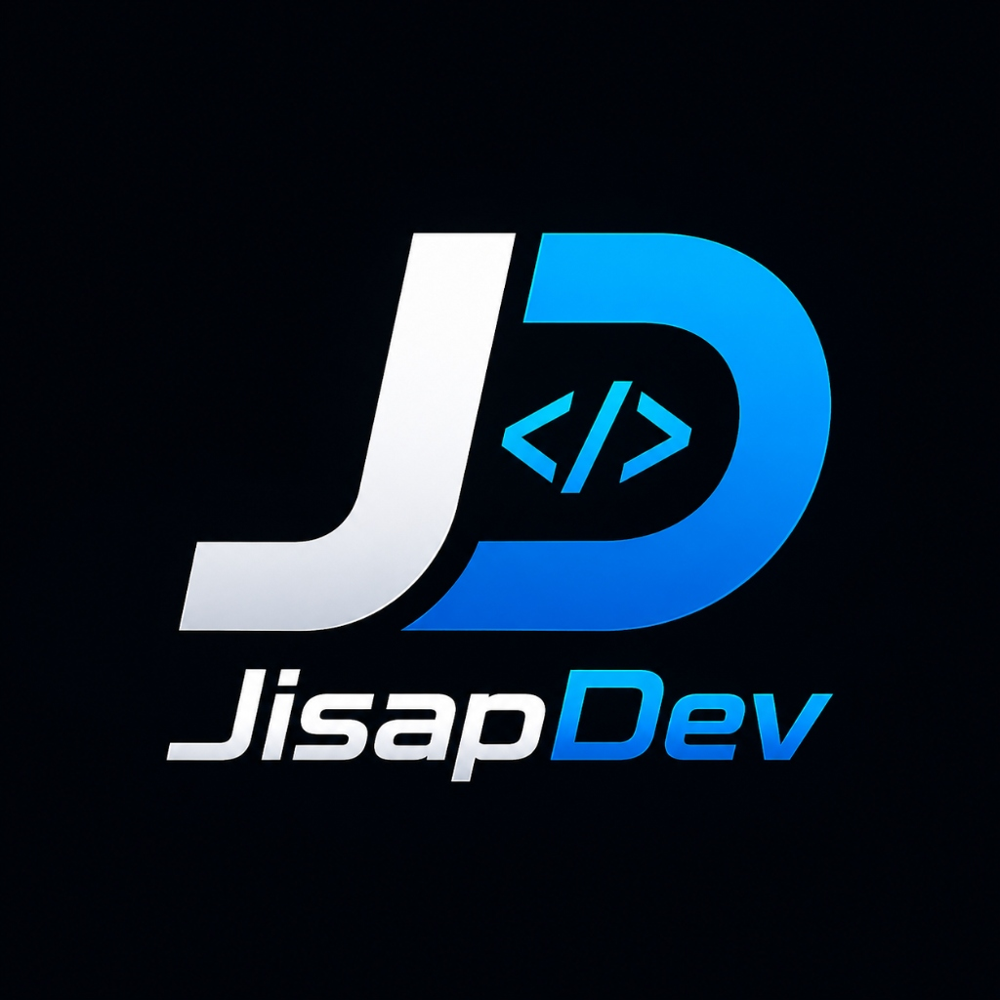

# SnippetManager 🚀

<div align="center">
  
  <br />
  <p><strong>Tu gestor personal de snippets de código y notas técnicas.</strong></p>
  <p>Desarrollado con dedicación por <strong>JisapDev</strong></p>
  
  [](LICENSE)
  [](https://nextjs.org/)
  [](https://tailwindcss.com/)
  [](https://www.prisma.io/)
  [](https://supabase.com/)
</div>

---

## ✨ Características

- ⚡ **Editor VS Code (Monaco)** integrado para una experiencia de programación nativa en el navegador.
- 🎨 **Resaltado de Sintaxis Shiki** con temas profesionales (GitHub Dark, Dracula, One Dark Pro).
- 📊 **Doble vista de Snippets**: Alterna entre cuadrícula de tarjetas visuales o vista en **tabla compacta tipo Excel / Data Grid** con ordenación por columnas.
- 🔍 **Búsqueda Instantánea Difusa (Fuse.js)** por título, lenguaje, tags y contenido de código.
- 🔐 **Autenticación Segura (Supabase)** con aislamiento de datos privados por usuario y soporte para migración fluida de datos legacy.
- 📝 **Bloc de Notas Markdown** enriquecido con previsualización en vivo para cada snippet.
- 💾 **Exportación e Importación de Copias de Seguridad (JSON)** y exportación a imagen PNG de alta resolución.
- ⭐ **Favoritos y Tags interactivos** para organización rápida.

---

## 🛠️ Tecnologías

- **Framework**: Next.js 16 (App Router + Turbopack)
- **Lenguaje**: TypeScript
- **Base de Datos & ORM**: PostgreSQL / SQLite con Prisma ORM
- **Autenticación**: Supabase Auth (@supabase/ssr)
- **Estilos & Animaciones**: Tailwind CSS v4 + Framer Motion + Lucide Icons

---

## 🚀 Inicio Rápido

1. Clona el repositorio:
```bash
git clone https://github.com/jisapdev/next16-mysnippetmanager.git
cd next16-mysnippetmanager
```

2. Instala las dependencias:
```bash
npm install
```

3. Configura tus variables de entorno en `.env`:
```env
DATABASE_URL="file:./dev.db"
NEXT_PUBLIC_SUPABASE_URL="tu_supabase_url"
NEXT_PUBLIC_SUPABASE_ANON_KEY="tu_supabase_anon_key"
```

4. Ejecuta las migraciones de base de datos e inicia el servidor de desarrollo:
```bash
npx prisma generate
npm run dev
```

---

## 📄 Licencia

Este proyecto está bajo la Licencia **MIT**. Consulta el archivo [`LICENSE`](LICENSE) para más detalles.

Copyright (c) 2026 **JisapDev**.
